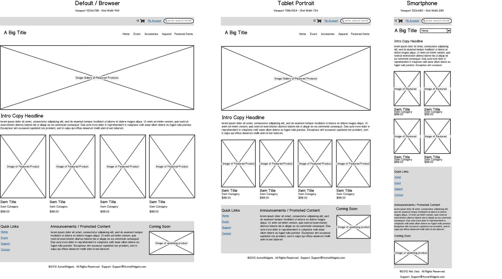
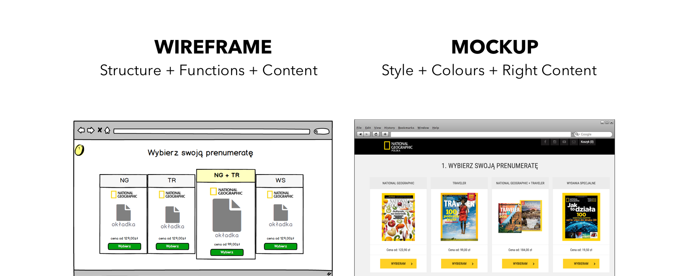

% WELCOME

# Fullstackwebdev workshop
**DAY 1**

# 
## 1. Purpose
**What is meant by Purpose?**

# 
## 
Good web design and development should always address the **_needs of the user_**

# 
## 
Consider what **_type_** of **_information_** the end-user will be looking for:

- Is it for entertainment purposes?

- Is it for communication & booking purposes?

- Is it for a business transaction?

# 
## 
Each section & page of your website needs to have a **_clear purpose_** and help visitors to find what they need.

# 
## 
A good web developer/designer has the responsibility to **_convey the objective_** of a website **_clearly_** to the user.

# 
## 
**Examples:**

- [blog](https://www.helpscout.com/blog/)

- [portfolio](https://www.susannahrigg.com/)

- [e-commerce](https://www.bol.com/nl/)

# 
## 
**How can we achieve conveying Purpose?**

# 
## 
When we have properly identified the **_purpose_** or meaning of the
website to the end-user, we need proper **_communication_**.

# 
## 2.COMMUNICATION
**What is meant by Communication?**

- Web visitors these days want **_information quickly_**, so it is important to communicate **_clearly_**.

- Information on a website should be **_concise_** and easy to digest.

# 
## 
Some effective tactics to have in your web design include:

- **_Organizing_** information using **_headlines_** and **_sub-headlines_**.

- **_Engaging_** the user's flow effectively by providing good **_Navigation_** & **_Call-To-Actions_**.

- **_Avoiding_** the use of **_long & complicated sentences_**.

# 
## 
**tactics pt.2**

- Presenting the **_benefits_** and **_services_** of this website:

- **_Trust indicators_** (testimonials, social proof, etc).

- Making **_images_** and **_icons_**.

# 
## 
Back to the website example, can you **recognise any tactics**?

# 
## 
**How can we achieve good Communication?**

Like when building or creating anything in life, you first need to start with the proper **_blueprint_**.

# 
## 
A web design blueprint will act as ​the **_structure​_** that will help and
guide you when you start developing websites.

# 
## 
What's your **_favourite website_**? What do you like the most about it?

# 
## 3.STRUCTURE
**What is meant by Structure?**

# 
## 
The structure of a website relies heavily on having a **_good design_** in place before development.

# 
## 
In many ways, the structure is the **_combination_** of understanding ​what the **_purpose_** ​of the website is and ​how to **_communicate​_** it effectively.

# 
## 
When the **_Purpose_** & **_Communication_** aspects are clearly addressed then we can start on the process to create a good and structured web design.

A design in which we can later develop and work alongside our code.

# 
## 
**How can we achieve good Structure?**

# 
## 
A first step that can help from idea to conception is by utilizing **_pen & paper_** to create a **_wireframe_** of the website. 

In this mock you consider aspects of the site such as: 

- **_ABOVE-THE-FOLD_**

- **_BELOW-THE-FOLD_**

# 
## 
Before we jump into these two concepts...
Here is an example of what is a **_wireframe_**:

# 
## 
Wireframe Vs. Mokup

# 
## 
**ABOVE-THE-FOLD**

The **_navigation bar_**: 
- Logo (​Who/What is this website?)​ 
- Menu Links (​Where can the end-user navigate to?​)

# 
## 
**ABOVE-THE-FOLD pt.2**

The **_intro header_** (Hero): 
- Header (​What does the company do?​) 
- Sub-header (​What problems are solved?​) 
- Call-To-Action (​What should visitors do?)​

# 
## 
**BELOW-THE-FOLD**

The **_benefits_** list: 
- Services provided by the website that solves a problem (How they can help the end-user?)

The **_feature_** highlights: 
- Portfolio block (What exactly is the end-user getting? What has the service/product of the website achieved?)

# 
## 
**BELOW-THE-FOLD pt.2**

The **_trust_** indicators: 
- People Testimonials (What are the success stories?) 
- Company logos (Which collaborations have been made?)

The **_footer_**: 
- Useful website links 
- Offers / Newsletter Subscription 
- Logo + Copyright - Call-To-Action (optional)

# 
## 
Designing site **_layouts / templates_**. From pen & paper to using online resources such as Figma or professional tools such as Photoshop/Illustrator.
